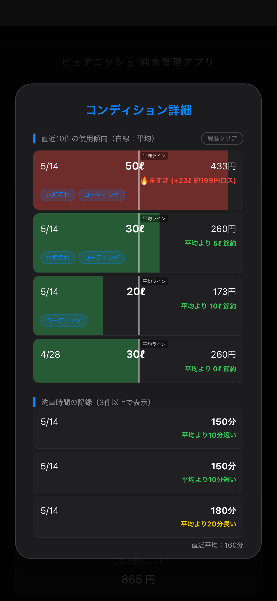
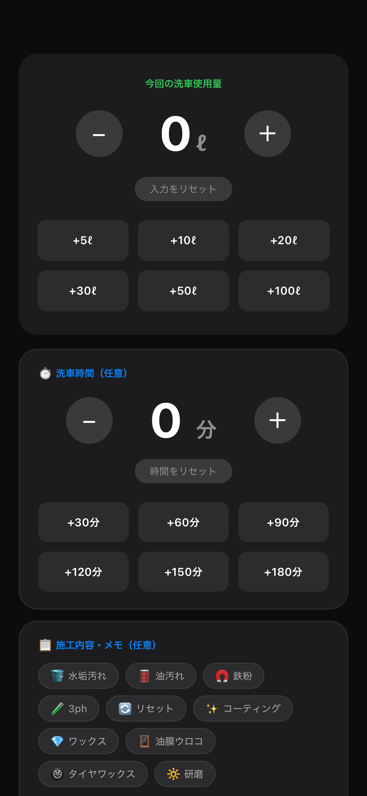
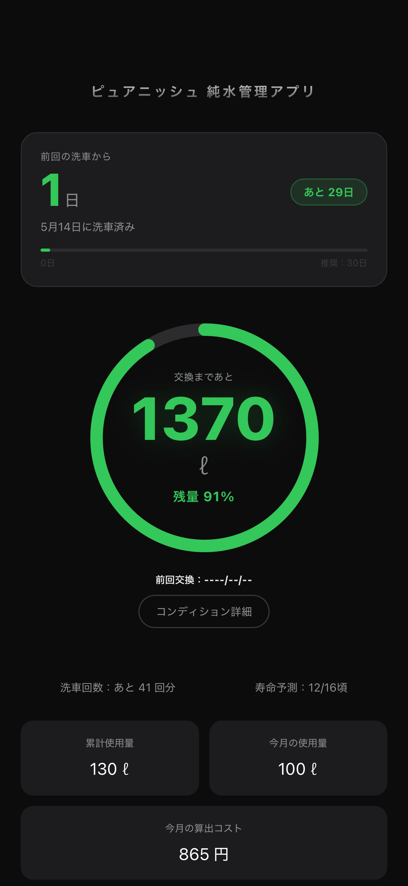

# Pure Water Tracker for Purenish

**「ピュアニッシュユーザーのための、純水管理をもっとシンプルに。」**

本アプリは、グリーンライフ社製「ピュアニッシュ PRO / JUST」専用の純水管理ツールです。  
洗車ごとの使用量を記録し、樹脂の残量・寿命・コストをリアルタイムで把握できます。

> 🎉 **444回クローン・83名にご利用いただいています（GitHub Insightsより）。**  
> ピュアニッシュユーザーの皆様からの関心に、心から感謝いたします。

-----

## 📱 アプリ画面

  
  
  

> 左から：**メイン画面**（残量・寿命をリアルタイム可視化）／**記録画面**（使用量・洗車時間をワンタップ入力）／**コンディション詳細**（履歴・コスト・交換時期を自動診断）

-----

## 🚀 今すぐ使う

**[Pure Water Tracker for Purenish を開く](https://missinglink4179.github.io/Pure-Water-Tracker/)**

インストール不要・完全無料・スマホのブラウザだけで動作します。

### ⚡ Quick Start（3ステップ）

1. **アプリを開く** — 上記リンクをタップするだけ。アカウント登録不要。
1. **水道水硬度（PPM）を入力** — お住まいの地域のPPMを入力してください。
1. **機種を選択** — PRO（3個）またはJUST（2個）を選ぶと、残量・寿命・コストが自動算出されます。

> 💡 **ホーム画面に追加するとアプリのように使えます。**  
> iPhoneの場合：Safariで開いて下部の「共有」→「ホーム画面に追加」  
> Androidの場合：Chromeで開いてメニュー→「ホーム画面に追加」

-----

## ✅ 主な機能

|機能          |内容                       |
|------------|-------------------------|
|樹脂残量リアルタイム表示|PPMと使用量から残量・残量%をリング表示    |
|純水使用量記録     |洗車ごとの使用量をワンタップで入力・保存     |
|洗車時間記録      |施工時間を記録し、平均との比較が可能       |
|樹脂寿命予測      |過去の使用傾向から交換時期を自動予測       |
|月別コスト集計     |月ごとの使用量・算出コストをサマリー表示     |
|コンディション診断   |使用傾向・コスト・交換時期を総合診断       |
|施工内容タグ記録    |水垢・鉄粉・コーティングなど10種のタグで記録  |
|カレンダー連携     |洗車記録をApple・Googleカレンダーに追加|
|2連結モード      |ピュアニッシュを2台連結している場合に対応    |
|データ移行・復元    |機種変更時もコードで記録を引き継げる       |

-----

## ✨ 特徴

- **ピュアニッシュ専用設計**: PRO（3個）/ JUST（2個）の樹脂構成に最適化。機種選択だけで自動設定されます。
- **2連結モード対応**: 2台連結でお使いの方も、合算した残量・コストを正確に管理できます。
- **洗車ログが充実**: 使用量・洗車時間・施工内容タグ・メモを一括記録。洗車の振り返りに役立ちます。
- **完全ローカル保存**: データはすべてお使いの端末に保存されます。外部への送信はありません。
- **非営利・無料**: 本アプリは完全無料・非営利で公開しています。

-----

## 💚 開発の想い

本アプリは、私が洗車を学ぶ中で多大な影響を受け、日頃からお世話になっている **BeautifulCars（ビューティフルカーズ）村上社長** にご相談し、直接ご意見を伺いながら完成させた、開発の原点とも言えるアプリです。

ピュアニッシュ（グリーンライフ社製・BeautifulCars監修）は、生成量の基準PPMを明記した誠実なメーカーです。私自身2年以上ピュアニッシュPROを使い続け、その品質を実証してきました。

このアプリが、ピュアニッシュユーザーの皆様の純水管理を少しでも楽にできれば幸いです。

-----

## 🔗 汎用版（General Edition）について

本アプリはピュアニッシュ専用版ですが、**あらゆるメーカーの純水器に対応した汎用版**も公開しています。

汎用版では、ユーザーの皆様から実測データをご提供いただき、メーカー横断での樹脂効率比較・可視化を目指しています。

**[Pure Water Tracker (General Edition) を使ってみる](https://missinglink4179.github.io/pure-water-generic/)**

-----

## 🛠 Built With

- HTML / CSS / JavaScript
- PWA（Progressive Web App）
- LocalStorage（端末内データ保存）
- GitHub Pages（ホスティング）

-----

## ⚠️ 免責事項

- 本アプリは個人開発の非公式ツールです。グリーンライフ社・BeautifulCars様とは一切関係ありません。
- 数値は算出理論値に基づく目安であり、正確性や樹脂の寿命を保証するものではありません。
- 本アプリの利用により生じたトラブルや損失・損害について、開発者は一切の責任を負いません。
- 無断転載・再配布、および商用利用を固く禁じます。

-----

### 🔍 検索キーワード (SEO)

ピュアニッシュ 純水 管理 / ピュアニッシュPRO 寿命 / ピュアニッシュJUST 使用量 / 純水器 管理アプリ / 洗車 純水 記録 / イオン交換樹脂 コスパ / 純水生成量 実測 / グリーンライフ 純水器 / BeautifulCars 純水