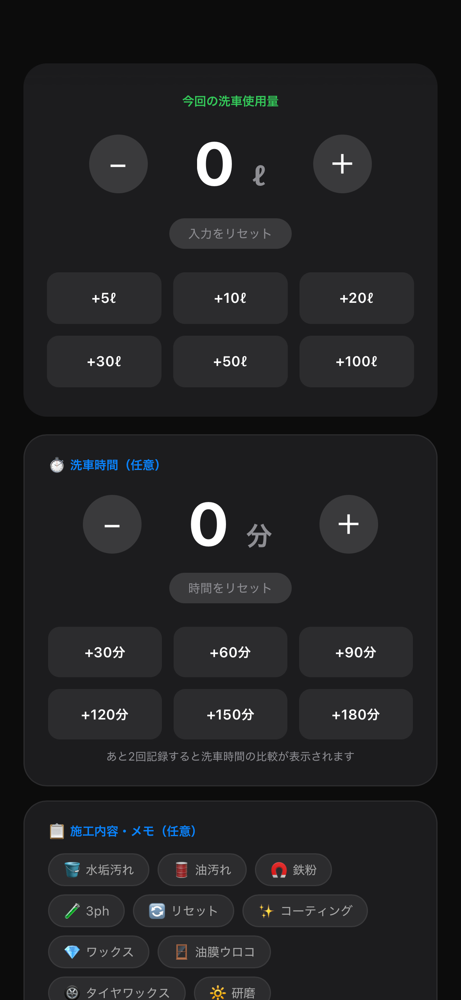
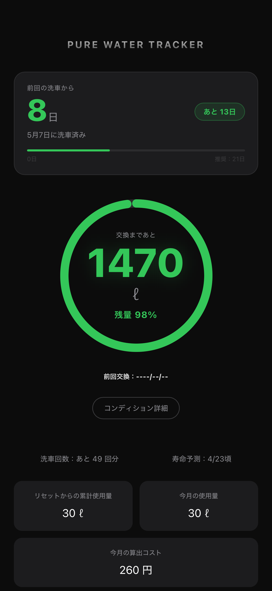
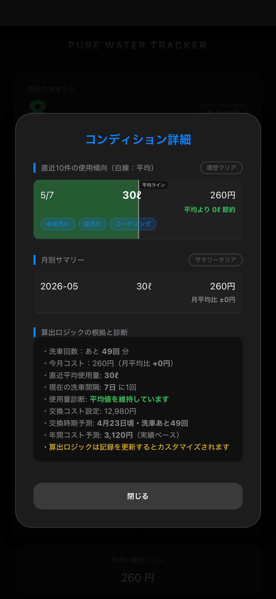

# Pure Water Tracker (General Edition)

**「メーカー公表値を超えて、純水器の『真の実力』を可視化する。」**

純水器の使用量・樹脂寿命・ランニングコストを記録／可視化するWebアプリです。  
メーカー非依存で、樹脂量・TDS値・購入価格を自由に設定できます。  
洗車ごとの実測データから、交換時期とコスパを現実ベースで把握できます。

> 🎉 **公開14日間で400回以上クローンされました（GitHub Insightsより）。**  
> 純水ユーザーの皆様からの関心に、心から感謝いたします。

---

## 📱 アプリ画面

  
  
  

> 左から：**記録画面**（使用量・洗車時間をワンタップ入力）／**メイン画面**（残量・寿命をリアルタイム可視化）／**コンディション詳細**（履歴・コスト・交換時期を自動診断）

---

## 🚀 今すぐ使う

**[Pure Water Tracker (General Edition) を開く](https://missinglink4179.github.io/pure-water-generic/)**

インストール不要・完全無料・スマホのブラウザだけで動作します。

### ⚡ Quick Start（3ステップ）

1. **アプリを開く** — 上記リンクをタップするだけ。アカウント登録不要。
2. **純水器の情報を入力** — メーカー・樹脂量・購入価格をカスタム入力。あらゆる機種・自作システムに対応。
3. **TDS値（水道水の硬度）を入力** — お住まいの地域のPPMを入力すると、残量・寿命・コストが自動算出されます。

> 💡 **ホーム画面に追加するとアプリのように使えます。**  
> iPhoneの場合：Safariで開いて下部の「共有」→「ホーム画面に追加」  
> Androidの場合：Chromeで開いてメニュー→「ホーム画面に追加」

---

## ✅ 主な機能

| 機能 | 内容 |
|------|------|
| 樹脂残量リアルタイム表示 | 使用量とTDS値から残量・残量%をリング表示 |
| 純水使用量記録 | 洗車ごとの使用量をワンタップで入力・保存 |
| 洗車時間記録 | 施工時間を記録し、平均との比較が可能 |
| 樹脂寿命予測 | 過去の使用傾向から交換時期を自動予測 |
| 月別コスト集計 | 月ごとの使用量・算出コストをサマリー表示 |
| コンディション診断 | 使用傾向・コスト・交換時期を総合診断 |
| カレンダー連携 | 洗車記録をApple・Googleカレンダーに追​​​​​​​​​​​​​​​​
